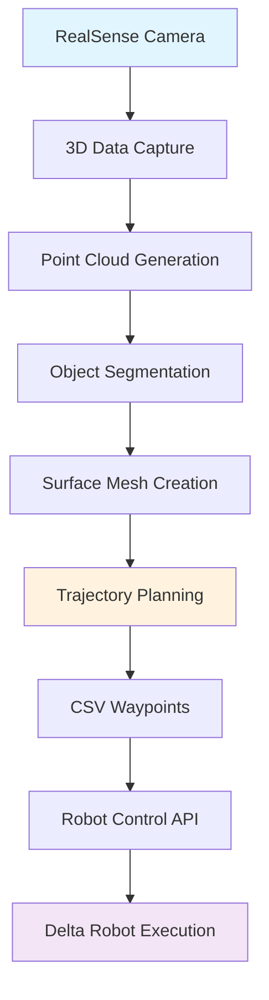

# **Robotic Polishing System**

## **Project Overview**

This project presents a complete pipeline for automated robotic polishing of complex 3D objects. It integrates hardware control (robotic arm and a RealSense camera) with a sophisticated software workflow, covering everything from 3D data capture and processing to trajectory planning and execution. The system is designed to provide a reproducible, automated solution for surface finishing, which is a critical process in industries such as manufacturing, aerospace, and medical devices.

The core problem addressed is the need to precisely control a robotic arm to follow a complex, non-linear path on an irregularly shaped object. The solution is a modular system where each component handles a specific task, making the entire process robust and scalable.


*Complete robotic polishing system setup showing the delta robot configuration with control platform*

## **Key Features**

* **3D Data Capture:** Captures high-resolution color and depth data from a RealSense camera.  
* **Point Cloud & Mesh Processing:** Segments the object from its environment and reconstructs a clean 3D mesh.  
* **Automated Trajectory Planning:** Generates a custom polishing path (a series of XYZ and orientation waypoints) optimized for the object's surface geometry.  
* **Robotic Arm Control:** Executes the planned trajectory by sending precise commands to a robotic arm via a custom API.  
* **Real-time Visualization:** Provides real-time visualization of the camera feed and the point cloud data for quality assurance.  
* **Modular Architecture:** The system is broken down into distinct scripts for data capture, mesh processing, and robot control, allowing for independent development and debugging.

## **System Hardware**


*Delta robot mechanism with parallel kinematic structure for precise 3-axis movement*

The system utilizes a delta robot configuration with parallel kinematics, providing high precision and speed for polishing operations. The setup includes:
- Delta robot with 3-DOF parallel mechanism
- Control electronics and power supply
- Mounting platform for workpieces
- Safety enclosure with transparent panels

## **Project Pipeline**

This project is a perfect example of a robotics workflow. The scripts and data files work together in a logical sequence:

### 1. Data Acquisition (camara2.py)
The process begins with capturing 3D data. The camara2.py script utilizes the RealSense SDK to stream RGB and depth data. It applies a mask to isolate the object of interest and then, upon user input ('s' key), saves the current view as a .ply point cloud file.


*Real-time depth and RGB data visualization from RealSense camera with object masking*

The image above shows the camera interface with:
- **Depth visualization** (center window): Grayscale depth map showing object geometry
- **Mask window** (right): Binary mask isolating the target object from background
- **RGB feed** (left): Color image with object detection overlay

### 2. Mesh Segmentation (camera_3 (1).py)
Once a point cloud file is captured, camera_3 (1).py processes it. This script takes the raw point cloud and performs a series of advanced segmentation steps:


*Point cloud segmentation showing object isolation (red) from background (green)*

* **RANSAC:** Removes the flat base plate the object is sitting on.  
* **DBSCAN:** Clusters the remaining points to identify and isolate the main object from any surrounding noise or clamps.  
* **Top Patch Extraction:** A final step extracts only the top, convex or concave surface of the object—the precise area that needs to be polished.

### 3. Trajectory Planning (CUDA WITH XYZ RPY ANGLE CSV (1).py)
The core of the planning stage. This script takes the segmented object_top_patch_mesh.ply file and generates a precise polishing trajectory.
* It uses Open3D for 3D geometry processing.  
* It defines a path over the object's surface, interpolating waypoints to create a smooth trajectory.  
* The waypoints, consisting of X, Y, Z coordinates and Roll, Pitch, Yaw angles, are written to a CSV file (polishing_trajectory.csv). This CSV serves as the shared data format between the planning and execution stages.

### 4. Robot Execution (Api_Aduza (1).py)
This script is the final link in the chain. It reads the pre-planned trajectory from polishing_trajectory.csv.
* It connects to the robotic arm via a custom aduza API.  
* It iterates through each waypoint in the CSV file, sending absolute move commands to the robot.  
* The script controls the speed and smoothness of the robot's movement (TIME_PER_SEGMENT, STEPS_PER_SEGMENT) to ensure a consistent polishing operation.

## **Files & Their Roles**

| File Name | Role in Project |
| :---- | :---- |
| camara2.py | **Data Capture:** Captures and saves point cloud data from a RealSense camera. |
| camera_3 (1).py | **Mesh Processing:** Segments a 3D mesh to isolate the object and the specific area for polishing. |
| CUDA WITH XYZ RPY ANGLE CSV (1).py | **Trajectory Planning:** Generates a robot trajectory based on the mesh geometry and exports it to a CSV file. |
| polishing_trajectory.csv | **Trajectory Data:** The output of the planning script and the input for the robot control script. Contains XYZ and orientation waypoints. |
| Api_Aduza (1).py | **Robot Control:** Reads the trajectory from the CSV file and commands the robot to perform the polishing sequence. |

## **Technical Details & Libraries**

* **Python:** The entire project is developed in Python.  
* **Pyrealsense2:** Library for interacting with the Intel RealSense depth camera for data capture.  
* **OpenCV (cv2):** Used for real-time visualization of the camera feeds.  
* **Open3D:** A powerful library for 3D data processing, including point cloud to mesh conversion, plane segmentation (RANSAC), and clustering (DBSCAN).  
* **Scipy:** Used for trajectory smoothing via spline interpolation.  
* **Plotly & Matplotlib:** Used to generate interactive 3D visualizations and animations of the planned trajectories.  
* **Pandas/Numpy:** For efficient handling of numerical data, particularly for reading and writing the trajectory CSV file.  
* **Aduza API:** A proprietary or custom library for communicating with and controlling the specific robotic arm.

## **System Workflow Visualization**



## **Results and Performance**

The system demonstrates successful integration of computer vision, 3D processing, and robotic control for automated polishing applications. Key achievements include:

- **Accurate object detection and segmentation** from cluttered environments
- **Precise trajectory generation** following object surface geometry  
- **Smooth robot execution** with configurable speed and path interpolation
- **Modular architecture** allowing independent development and testing of each component

## **Future Improvements**

* **Automated Data Capture:** Integrate the capture script into the main pipeline to automatically trigger when an object is detected, rather than relying on manual key presses.  
* **Real-time Trajectory Generation:** Optimize the trajectory planning script to run in near real-time, allowing for on-the-fly planning.  
* **Force-Torque Sensor Integration:** Incorporate a force-torque sensor at the robot's end-effector to enable adaptive polishing. The robot could adjust its applied force to maintain a consistent pressure on the object's surface, improving polishing quality.  
* **GUI Development:** Create a user-friendly graphical interface to manage the entire workflow, from selecting a file to initiating the polishing run.
* **Multi-object Processing:** Extend the system to handle multiple objects in a single session with automatic object detection and queue management.

## **Installation and Setup**

### Prerequisites
```bash
pip install pyrealsense2 opencv-python open3d scipy plotly matplotlib pandas numpy
```

### Hardware Requirements
- Intel RealSense depth camera (D400 series recommended)
- Delta robot with parallel kinematics
- Control system with Aduza API compatibility
- Adequate lighting for optimal camera performance

### Usage
1. **Data Capture**: Run `camara2.py` to capture point cloud data
2. **Processing**: Execute `camera_3 (1).py` for object segmentation  
3. **Planning**: Use `CUDA WITH XYZ RPY ANGLE CSV (1).py` for trajectory generation
4. **Execution**: Run `Api_Aduza (1).py` to control the robot and execute polishing

## **Contributing**

This project welcomes contributions in the following areas:
- Algorithm optimization for real-time processing
- Integration with additional robot platforms
- Enhanced visualization and monitoring tools
- Force control and adaptive polishing strategies

## **License**

[Specify your license here]

## **Contact**

[Your contact information]
